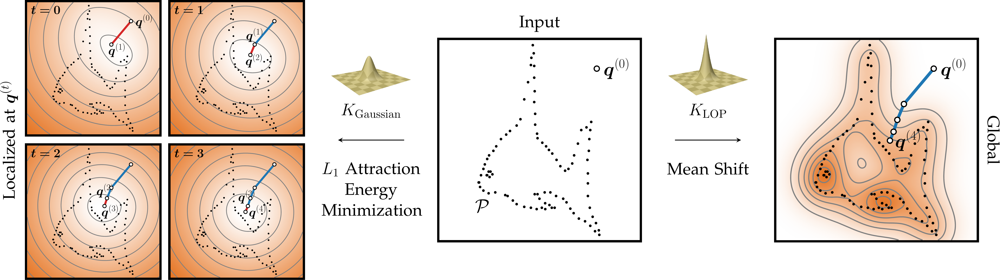

<h1 align="center">Incomplete Gamma Kernels: Generalizing Locally Optimal Projection Operators</h1>

<!-- start readme -->

<p align="center">
    <p align="center">
        <b><a href="https://cg.cs.uni-bonn.de/person/dr-patrick-stotko">Patrick Stotko</a></b><sup>1</sup>
        &nbsp;·&nbsp;
        <b><a href="https://www.tudelft.nl/en/eemcs/the-faculty/departments/intelligent-systems/computer-graphics-and-visualization/people/michael-weinmann">Michael Weinmann</a></b><sup>2</sup>
        &nbsp;·&nbsp;
        <b><a href="https://cg.cs.uni-bonn.de/person/prof-dr-reinhard-klein">Reinhard Klein</a></b><sup>1</sup>
    </p>
    <p align="center">
        <sup>1</sup>University of Bonn
        &nbsp;
        <sup>2</sup>Delft University of Technology
    </p>
    <h3 align="center">TPAMI 2024</h3>
    <h3 align="center">
        <a href="https://cg.cs.uni-bonn.de/backend/v1/files/publications/stotko_2024.pdf">Paper</a>
        &nbsp; | &nbsp;
        <a href="https://cg.cs.uni-bonn.de/publication/stotko-2024-incomplete">Project Page</a>
    </h3>
    <div align="center"></div>
</p>

<p align="center">
    
</p>

Official implementation of our paper "Incomplete Gamma Kernels: Generalizing Locally Optimal Projection Operators".


## Abstract

We present incomplete gamma kernels, a generalization of Locally Optimal Projection (LOP) operators. In particular, we reveal the relation of the classical localized <i>L<sub>1</sub></i> estimator, used in the LOP operator for point cloud denoising, to the common Mean Shift framework via a novel kernel. Furthermore, we generalize this result to a whole family of kernels that are built upon the incomplete gamma function and each represents a localized <i>L<sub>p</sub></i> estimator. By deriving various properties of the kernel family concerning distributional, Mean Shift induced, and other aspects such as strict positive definiteness, we obtain a deeper understanding of the operator's projection behavior. From these theoretical insights, we illustrate several applications ranging from an improved Weighted LOP (WLOP) density weighting scheme and a more accurate Continuous LOP (CLOP) kernel approximation to the definition of a novel set of robust loss functions. These incomplete gamma losses include the Gaussian and LOP loss as special cases and can be applied to various tasks including normal filtering. Furthermore, we show that the novel kernels can be included as priors into neural networks. We demonstrate the effects of each application in a range of quantitative and qualitative experiments that highlight the benefits induced by our modifications.

## BibTeX

```
@article{stotko2024incomplete,
	 title   = {Incomplete Gamma Kernels: Generalizing Locally Optimal Projection Operators},
	 author  = {Patrick Stotko and Michael Weinmann and Reinhard Klein},
	 journal = {IEEE Transactions on Pattern Analysis and Machine Intelligence (TPAMI)},
	 year    = {2024},
	 doi     = {10.1109/TPAMI.2024.3349967},
}
```

## Updates

- **[2024-10-16]** The code of our "Incomplete Gamma Kernels" paper is released! This version is rewritten from scratch in **PyTorch** with custom optimized C++/CUDA code and runs **4x - 7x faster** than the original code. We tried to ensure that the results are identical to the reported values (up to numerical accuracy) but there might be minor differences.


## Prerequisites

First, make sure that the following tools are installed as they are needed for JIT compiling and running the code:

- Python >= 3.9
- CUDA >= 12.4
- C++17 compiler

Then, install the project in a fresh environment:

```sh
# Clone repository
git clone https://github.com/stotko/incomplete-gamma-kernels.git
cd incomplete-gamma-kernels

# Create environment
conda create -n igk python=3.9
conda activate igk

# Install PyTorch with CUDA support
pip install torch --index-url https://download.pytorch.org/whl/cu124

# Install project including its dependencies
pip install .
```


## Usage

We provide example scripts to perform the experiments demonstrated in the paper in `examples/`. They can be executed by running the command:

```sh
python examples/<example_name>.py
```


## License

This software is provided under MIT license, with parts under BSD-3 license. See [`LICENSE`](https://github.com/stotko/incomplete-gamma-kernels/blob/main/LICENSE) for more information.


## Contact

Patrick Stotko - <a href="mailto:stotko@cs.uni-bonn.de">stotko@cs.uni-bonn.de</a><br/>

<!-- end readme -->
